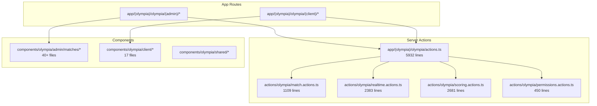

# Olympia Codebase Refactor & Latency Optimization Plan

## Overview

Structural refactoring of the Olympia codebase to reduce code duplication and improve maintainability **without changing any behavior, data flow, or transaction boundaries**.

## System Mapping Summary

### Architecture Overview



### Identified Issues

| Issue | Impact | Files Affected |
|-------|--------|----------------|
| `utf8ByteLength()` duplicated | Bundle bloat | 6 files |
| `estimateFormDataPayloadBytes()` duplicated | Bundle bloat | 5 files |
| `traceInfo()` pattern duplicated | Maintenance burden | 5 files |
| `requireOlympiaAdminContext()` duplicated | Maintenance burden | 3 action files |
| `perfAction()` duplicated | Maintenance burden | 3 action files |
| `actions.ts` re-exports + inline code | Confusing architecture | 1 file (5932 lines) |

---

## Proposed Changes

### Component 1: Shared Olympia Trace Utilities

Create a centralized module for trace/perf utilities used across server actions.

#### [NEW] [olympia-trace.ts](file:///d:/app/edu-sync/lib/olympia/olympia-trace.ts)

Extract and consolidate duplicated functions:
- `utf8ByteLength(text: string): number`
- `estimateFormDataPayloadBytes(formData: FormData): number`
- `readStringFormField(formData: FormData, key: string): string | null`
- `getOrCreateTraceId(formData: FormData): string`
- `traceInfo(params: {...}): void`
- `makePerfId(): string`
- `perfAction<T>(label: string, fn: () => Promise<T>): Promise<T>`
- Export `OLYMPIA_ACTION_TRACE`, `OLYMPIA_ACTION_PERF_TRACE` constants

---

### Component 2: Shared Auth Context Helper

Create a centralized auth context helper for server actions.

#### [NEW] [olympia-auth.ts](file:///d:/app/edu-sync/lib/olympia/olympia-auth.ts)

Extract and consolidate:
- `requireOlympiaAdminContext(): Promise<{ supabase, appUserId }>`

---

### Component 3: Server Action Files Cleanup

Update action files to import from shared modules instead of duplicating code.

#### [MODIFY] [realtime.actions.ts](file:///d:/app/edu-sync/actions/olympia/realtime.actions.ts)

- Remove lines 17-116 (duplicated utility functions)
- Add imports from `@/lib/olympia/olympia-trace` and `@/lib/olympia/olympia-auth`
- Keep all action functions unchanged

#### [MODIFY] [scoring.actions.ts](file:///d:/app/edu-sync/actions/olympia/scoring.actions.ts)

- Remove lines 23-122 (duplicated utility functions)
- Add imports from `@/lib/olympia/olympia-trace` and `@/lib/olympia/olympia-auth`
- Keep all action functions unchanged

---

### Component 4: Actions Re-export Cleanup

Clean up the monolithic actions.ts file.

#### [MODIFY] [actions.ts](file:///d:/app/edu-sync/app/(olympia)/olympia/actions.ts)

- Remove all inline duplicate code (lines 5-93 and any other non-re-export code)
- Keep only clean re-exports:
  ```typescript
  "use server";
  export * from "@/actions/olympia/match.actions";
  export * from "@/actions/olympia/permissions.actions";
  export * from "@/actions/olympia/realtime.actions";
  export * from "@/actions/olympia/scoring.actions";
  ```

---

### Component 5: Client-Side Trace Utilities

Create shared client-side trace module for components.

#### [NEW] [olympia-client-trace.ts](file:///d:/app/edu-sync/lib/olympia/olympia-client-trace.ts)

Extract from `OlympiaGameClient.tsx` and `HostRealtimeEventsListener.tsx`:
- Client-side `utf8ByteLength()`
- Client-side `estimateFormDataPayloadBytes()`
- Client-side `estimateJsonPayloadBytes()`
- `createClientTraceId()`
- `traceClient(params: {...})`

#### [MODIFY] [OlympiaGameClient.tsx](file:///d:/app/edu-sync/components/olympia/shared/game/OlympiaGameClient.tsx)

- Remove lines 57-104 (duplicated utility functions)
- Add import from `@/lib/olympia/olympia-client-trace`

#### [MODIFY] [HostRealtimeEventsListener.tsx](file:///d:/app/edu-sync/components/olympia/admin/matches/HostRealtimeEventsListener.tsx)

- Remove lines 14-48 (duplicated utility functions)
- Add import from `@/lib/olympia/olympia-client-trace`

---

## Verification Plan

### Automated Tests

1. **Run existing scoring tests**:
   ```powershell
   cd d:\app\edu-sync
   npx vitest run tests/olympia-scoring.test.ts
   ```
   Expected: All 8 tests pass (unchanged behavior).

2. **TypeScript compilation check**:
   ```powershell
   cd d:\app\edu-sync
   npx tsc --noEmit
   ```
   Expected: No type errors.

3. **Development build test**:
   ```powershell
   cd d:\app\edu-sync
   npm run build 2>&1 | Select-String -Pattern "error|Error" -Context 0,2
   ```
   Expected: No build errors.

### Manual Verification

After the refactor, request user to verify:

1. **Admin Host Console**: Navigate to `/olympia/admin/matches/{matchId}/host` and confirm page loads correctly
2. **Client Game Page**: Navigate to `/olympia/client/game/{joinCode}` and confirm page loads correctly
3. **Action Functions**: Verify trace logs still appear in console when `OLYMPIA_TRACE=1`

---

## Behavior Preservation Confirmation

> [!IMPORTANT]
> This refactor is **strictly structural**. The following are explicitly preserved:

- ✅ All action function signatures unchanged
- ✅ All Supabase query logic unchanged
- ✅ All realtime channel subscriptions unchanged
- ✅ All event ordering preserved
- ✅ All transaction boundaries unchanged
- ✅ All component props/state unchanged
- ✅ No new buffering, batching, or debounce
- ✅ No new background jobs
- ✅ No new external libraries

---

## Files Summary

| Action | File | Change Description |
|--------|------|-------------------|
| NEW | `lib/olympia/olympia-trace.ts` | Shared server trace utilities |
| NEW | `lib/olympia/olympia-auth.ts` | Shared auth context helper |
| NEW | `lib/olympia/olympia-client-trace.ts` | Shared client trace utilities |
| MODIFY | `actions/olympia/realtime.actions.ts` | Import shared, remove duplicates |
| MODIFY | `actions/olympia/scoring.actions.ts` | Import shared, remove duplicates |
| MODIFY | `app/(olympia)/olympia/actions.ts` | Clean re-exports only |
| MODIFY | `components/olympia/shared/game/OlympiaGameClient.tsx` | Import shared, remove duplicates |
| MODIFY | `components/olympia/admin/matches/HostRealtimeEventsListener.tsx` | Import shared, remove duplicates |
